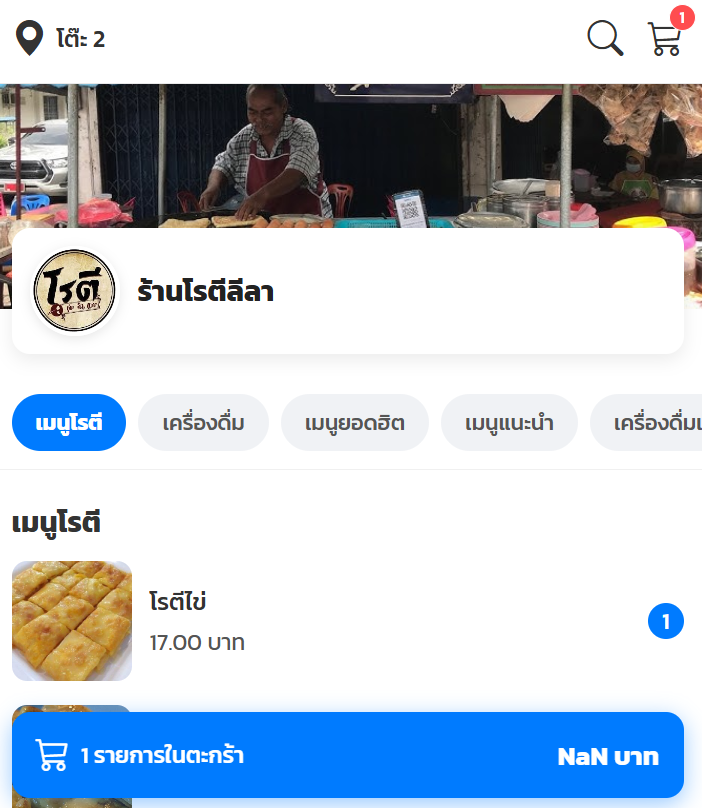
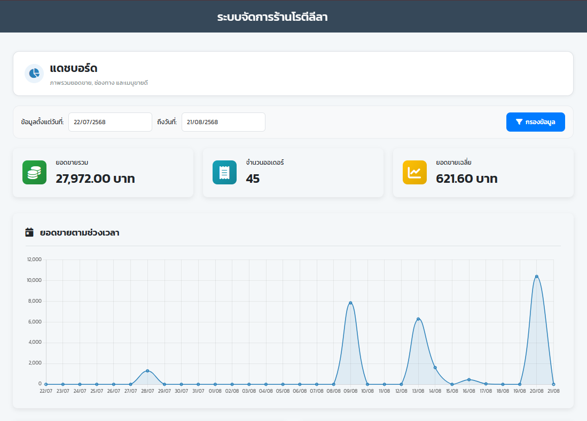
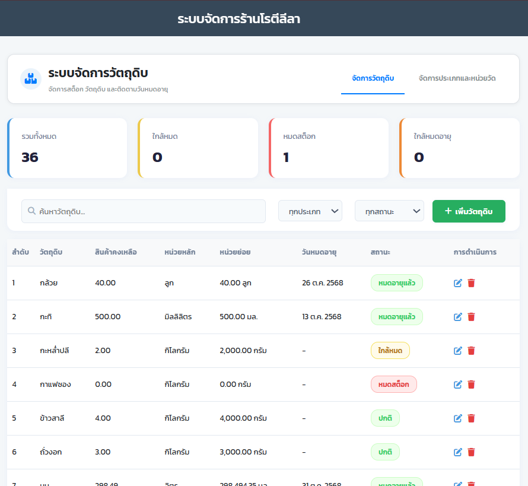

# 🌐 Live Demo
[คลิกเพื่อดูระบบจริง](http://106765033.student.yru.ac.th/auth/login.php)

> หมายเหตุ: ระบบ deploy บน server ของมหาวิทยาลัย 
> อาจไม่สามารถเข้าถึงได้หลังสำเร็จการศึกษา

# ชื่อระบบ
ระบบบริหารจัดการร้านโรตีลีลา
Business Management System Rotilila
|
เป็นระบบที่ช่วยจัดการร้านไม่ว่าจะเป็นด้านการสั่งออเดอร์ผ่านคิวอาร์โค้ด การตัดสต็อกวัตถุดิบ พร้อมรายงานวัตถุดิบคงเหลือในแต่ละวัน

# ฟีเจอร์หลักของระบบ
แอดมิน : สามารถแก้ไขข้อมูลของผู้ใช้ได้ ยกเว้นข้อมูลของเจ้าของร้าน

ลูกค้า : สามารถสั่งอาหารได้ผ่านการแสกนคิวอาร์โค้ดที่แปะตามโต๊ะ

พนักงานขาย : 1.สามารถกดเปิด-ปิดโต๊ะตามเวลานั้นๆ เพื่อป้องกันการสั่งอาหารจากบุคคลอื่น 
2.สามารถสั่งอาหารสำหรับลูกค้าที่สั่งหน้าร้านหรือไม่ถนัดสั่งผ่านคิวอาร์โค้ด 3.สามารถกดชำระเงินผ่านหน้าจอได้

ผู้จัดการ : 1.สามารถกดเพิ่มวัตถุดิบและเมนูอาหารต่างๆ 
2.สามารถเช็คบัญชีในระบบได้ 3.สามารถดูรายงานการใช้วัตถุดิบ การขาย และการเข้าใช้ระบบของแต่ละผู้ใช้ในแต่ละวันได้

เจ้าของร้าน : สามารถดูรายงานทั้งหมดในระบบได้ 

# ภาษาที่ใช้
HTML+CSS+JavaScript สำหรับส่วนของ Fontend
PHP สำหรับจัดการฐานข้อมูล
MySQL สำหรับเก็บฐานข้อมูล

# วิธี setup เพื่อ run บนเครื่อง
1.ติดตั้ง XAMPP
2.วางโฟลเดอร์โปรเจกต์ไว้ใน `C:/xampp/htdocs/`
3.เปิด phpMyAdmin แล้ว import ไฟล์ `database/rotilila2.sql`
4.แก้ไขไฟล์ `db_connect.php` ให้ตรงกับเครื่องของตัวเอง
5.เปิดเบราว์เซอร์แล้วไปที่ `localhost/rotilila2`

# หน้าตาของระบบ

# สิ่งที่ได้เรียนรู้จากโปรเจคนี้
1.ได้จัดระเบียบของระบบในแต่ละขั้นตอนก่อนลงมือทำ ว่าควรเริ่มทำอะไรก่อนหลัง หลังจากสร้างฐานข้อมูลแล้วควรเริ่มทำส่วนไหนต่อ เป็นต้น
2.ได้คิดตรรกะซับซ้อนเพื่อทำให้ระบบเป็นไปตามที่วางแผน เช่น จะตัดสต็อกของเมนูหนึ่ง ต้องตัดตามสูตรที่ลงไว้ในระบบและต้องแปลงหน่วย ให้ถูกต้องก่อนจะมีการตัดสต็อก จะใช้หน่วยไหนเป็นหน่วยกลางในการตัดสต็อก
3.ได้เห็นการทำงานของระบบที่มีการตัดสต็อกมากขึ้นว่า จะตั้งให้สต็อกถูกตัดตอนไหน ตอนที่ลูกค้ายืนยันสั่งอาหารเลยไหม หรือตอนที่พนักงานรับออเดอร์เรียบร้อยแล้ว ถ้าวัตถุดิบหมดในหน้าลูกค้าจะยังเห็นเมนูไหม 

# ปัญหาที่เจอและวิธีแก้
1.การตัดสต็อกไม่ตรงกับที่ควรเป็น
เช่น เมนูนี้ใช้แป้ง 250 กรัม แต่ระบบกลับไปตัดในสต็อกเป็น 250 กิโลกรัม เพราะในสต็อกตั้งหน่วยของแป้งเป็น กิโลกรัม
|--วิธีแก้--|
หาหน่วยกลางที่จะใช้สำหรับตัดสต็อก คือ ต้องการให้ระบบตัดสต็อกด้วยหน่วยกิโลกรัมหรือกรัม ถ้าเป็นหน่วยกรัม ก่อนตัดสต็อก ก็เขียนให้มีการแปลงหน่วยของกิโลกรัมในสต็อกเป็นกรัมก่อนแล้วเทียบค่าที่ส่ง
เข้ามาว่าเป็นเท่าไหร่ จากนั้นค่อยให้ระบบทำการตัดสต็อก

2.วัตถุดิบบางส่วนในสต็อกหมด แต่ในหน้าจอของลูกค้ายังเห็นเมนูนั้นอยู่
|--วิธีแก้--|
เชื่อมการทำงานของหน้าสต็อกกับลูกค้า คือกำหนดเงื่อนไขไว้ว่าถ้าวัตถุดิบในฐานข้อมูลตัวนี้เป็น 0 ในหน้าจอของลูกค้าก็จะ disable เมนูไว้